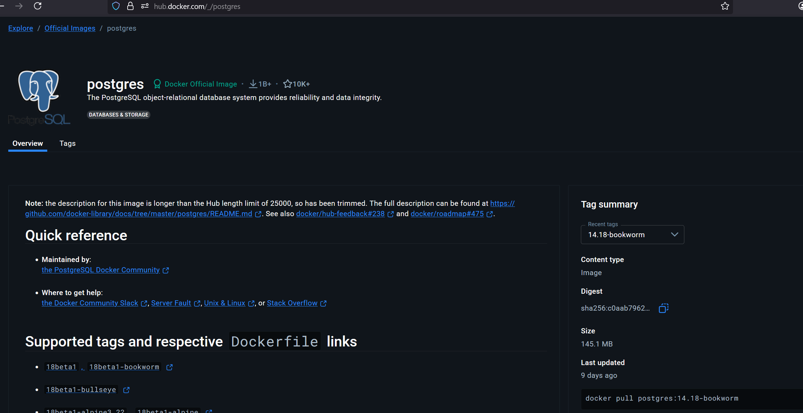
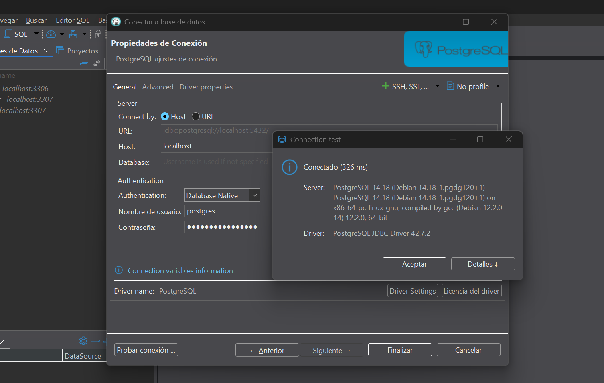

# 🧪 Docker – Variables de Entorno y Uso de Imágenes con Postgres

## 📌 Uso de Variables de Entorno en Docker

Puedes pasar variables de entorno al contenedor usando la opción `-e`:

```bash
docker run -d <imagen_id> \
    -e VAR_KEY1=value1 \
    -e VAR_KEY2=value2
```

---

## 🔍 Buscar imágenes en Docker Hub

Revisa imágenes oficiales y sus configuraciones en:  
🌐 [Docker Hub](https://hub.docker.com/)

---

## 🐘 Imagen oficial de Postgres

La imagen oficial de PostgreSQL en Docker Hub admite variables de entorno configurables.  
📄 [Postgres en Docker Hub](https://hub.docker.com/_/postgres)

- En la página encontrarás una plantilla para ejecutar el contenedor y verás las versiones disponibles en el panel lateral.

📸 Ejemplo visual:  


---

### ▶️ Ejemplo: Ejecutar Postgres con variables de entorno

```bash
docker run -d \
  --name some-postgres \
  -e POSTGRES_PASSWORD=mysecretpassword \
  -e PGDATA=/var/lib/postgresql/data/pgdata \
  -v /custom/mount:/var/lib/postgresql/data \
  postgres
```

- `POSTGRES_PASSWORD`: define la contraseña del usuario principal.  
- `PGDATA`: define el directorio interno de almacenamiento de datos.  
- `-v`: monta un volumen persistente entre el host y el contenedor.

> ℹ️ Si no se define `POSTGRES_USER`, por defecto será `postgres`.

---

## 🐘 Usar una versión específica de Postgres

```bash
docker pull postgres:14.18-bookworm
docker run -d \
  --name some-postgres \
  -e POSTGRES_PASSWORD=mysecretpassword \
  -e PGDATA=/var/lib/postgresql/data/pgdata \
  -v /custom/mount:/var/lib/postgresql/data \
  postgres:14.18-bookworm
```

Verificar contenedor:

```bash
docker container ls
```

🔎 Ejemplo de salida:
```bash
CONTAINER ID   IMAGE                     COMMAND                  CREATED         STATUS         PORTS      NAMES
efe8d0c44c51   postgres:14.18-bookworm   "docker-entrypoint.s…"   2 minutes ago   Up 2 minutes   5432/tcp   some-postgres
```

> ❗ En este punto, el contenedor está en ejecución pero **no se ha publicado el puerto** hacia el host, por lo que **no es accesible desde el exterior**.

---

## 🌐 Exponer el puerto de Postgres al host

```bash
docker run -d \
  --name some-postgres \
  -p 5432:5432 \
  -e POSTGRES_PASSWORD=mysecretpassword \
  -e PGDATA=/var/lib/postgresql/data/pgdata \
  -v /custom/mount:/var/lib/postgresql/data \
  postgres:14.18-bookworm
```

📦 Verificar:

```bash
docker container ls
```

Salida esperada:
```bash
CONTAINER ID   IMAGE                     COMMAND                  CREATED         STATUS         PORTS                                         NAMES
0cb2bbab9597   postgres:14.18-bookworm   "docker-entrypoint.s…"   6 seconds ago   Up 5 seconds   0.0.0.0:5432->5432/tcp, [::]:5432->5432/tcp   some-postgres
```

Ahora podrás conectarte desde el equipo host (por ejemplo con DBeaver, pgAdmin, etc.).

📸 Conexión desde cliente gráfico:  


---

## 💾 Persistencia de datos

La opción `-v` monta un volumen local al contenedor:

```bash
-v /custom/mount:/var/lib/postgresql/data
```

Esto asegura que los datos **no se pierdan** si se elimina el contenedor. Puedes ver el contenido del volumen:

```bash
ls /custom/mount
```

Salida esperada:
```bash
pgdata
```

Puedes volver a usar ese volumen con una nueva instancia del contenedor y se mantendrán los datos.


### Borrar imagne + valumen

```bash
$ docker rm -f 0cb2
0cb2

$ ls /custom/mount
pgdata

$ sudo rm -r /custom
[sudo] password for andre: 
```

---

## 🧊 ¿Qué es Alpine?

Las imágenes con `alpine` son versiones mínimas basadas en la distribución **Alpine Linux**.

✅ Características:
- Muy livianas
- Menor superficie de ataque (más seguras)
- Pocas dependencias

Ejemplo:  
```bash
docker pull postgres:alpine
```

> 🔎 Útil en producción, pero puede requerir instalar paquetes extra para ciertas operaciones.

---

## 🚀 Ejecutar dos imanges de Postgres en Docker

### ✅ Última versión estable (14.18-bookworm)

```bash
docker container run \
  --name postgres-alpha \
  -e POSTGRES_PASSWORD=pypass1 \
  -dp 5432:5432 \
  postgres:14.18-bookworm
```

- Se ejecuta en segundo plano (`-d`)
- Expone el puerto `5432` del contenedor al host
- Establece una contraseña para el usuario `postgres`

🆔 Ejemplo de ID de contenedor retornado:
```
c5a071f4c4bc3cf1af0cc287e525aaeeebaacfb388e3b21ce8896ac11bdccbff
```

> Esta imagen incluye todas las funcionalidades típicas de Postgres y se basa en Debian Bookworm.

---

### 🧊 Imagen ligera: Postgres 14 con Alpine Linux

```bash
docker container run \
  --name postgres-alpine \
  -e POSTGRES_PASSWORD=pypass1 \
  -dp 5433:5433 \
  postgres:14-alpine3.17
```

🆔 Ejemplo de ID de contenedor retornado:
```
406af7d759d06d4ac8dbc6922a7191c45bf5d3bb96fc23d3a7123e66f765676b
```
Esta imagen:

- Utiliza el puerto `5433` para evitar conflicto si ya hay otro contenedor en `5432`
- Imagen más liviana (~40MB)
- Basada en Alpine Linux (más segura, mínima)

#### 📦 Ventajas de usar `alpine`:
- Ideal para entornos de producción donde se busca reducir el tamaño de la imagen
- Carga más rápida
- Menor superficie de ataque

#### ⚠️ Consideraciones de usar `alpine`:
- Algunas herramientas o dependencias pueden faltar y requerir instalación adicional

---

## 📚 Recursos útiles

- 🐘 [Postgres en Docker Hub](https://hub.docker.com/_/postgres)
- 🌐 [Docker Hub](https://hub.docker.com/)
- 📘 [Docker Docs – Environment Variables](https://docs.docker.com/engine/reference/run/#env-environment-variables)

