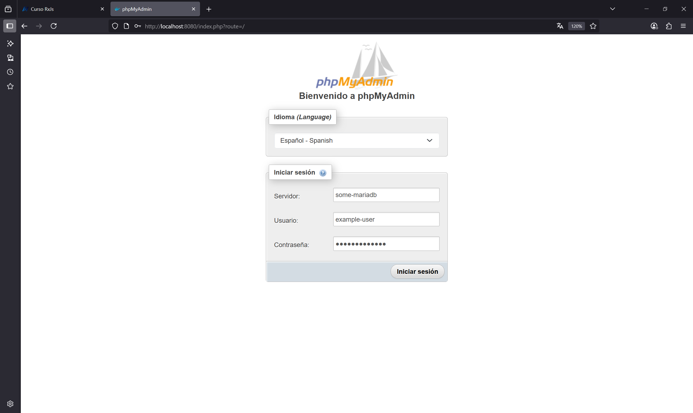

# 🌐 Redes en Docker

En Docker, las redes permiten que varios contenedores se comuniquen entre sí de forma segura y controlada.
👉 **Si los contenedores no están en la misma red, no podrán comunicarse directamente.**

📘 [Documentación oficial: Docker Networking](https://docs.docker.com/engine/network/)

---

## 🧰 Tipos de redes en Docker

| Tipo            | Descripción                                                                                         |
| --------------- | --------------------------------------------------------------------------------------------------- |
| `bridge`        | Red predeterminada para contenedores independientes. Ideal para entornos de desarrollo.             |
| `host`          | El contenedor comparte la pila de red del host (solo Linux).                                        |
| `none`          | Desactiva la red completamente. Útil para contenedores aislados.                                    |
| `overlay`       | Permite que contenedores en diferentes hosts se comuniquen. Se usa en entornos de Docker Swarm.     |
| `macvlan`       | Asigna una dirección MAC a los contenedores, actuando como dispositivos físicos en la red.          |
| `custom bridge` | Redes personalizadas `bridge`. Permiten mejor control de nombres y comunicación entre contenedores. |

---

## 📸 Esquema básico

```plaintext
+------------------+        +------------------+
|  Contenedor A    | <--->  |  Contenedor B    |
|  red: todo-app   |        |  red: todo-app   |
+------------------+        +------------------+

Ambos están en la red `todo-app` y pueden comunicarse por nombre de contenedor.
```

---

## 🧪 Crear una red personalizada

```bash
docker network create todo-app
```

Esto crea una red tipo `bridge` por defecto.

🔍 Ver redes existentes:

```bash
docker network ls
```

🕵️‍♂️ Inspeccionar una red:

```bash
docker network inspect todo-app
```

🧹 Eliminar redes no utilizadas:

```bash
docker network prune
```

---

## 🔗 Conectar contenedores a una red

Al crear un contenedor:

```bash
docker run -d --name backend --network todo-app node:alpine
```

O conectar un contenedor ya creado:

```bash
docker network connect todo-app backend
```

---

## 🔌 Comunicación entre contenedores

Si dos contenedores están en la misma red, pueden llamarse por **nombre**:

```js
fetch("http://backend:3000/api")
```

No hace falta exponer puertos al host si sólo se comunican entre ellos.

---

## 🧼 Desconectar y eliminar

Desconectar:

```bash
docker network disconnect todo-app backend
```

Eliminar:

```bash
docker network rm todo-app
```

---

## 📘 Referencias

* [Guía de redes de Docker (oficial)](https://docs.docker.com/engine/network/)
* [Tutorial de redes de Docker](https://docs.docker.com/engine/network/tutorials/)

--- 

```bash
# Listar los comandos disponibles
$ docker network
Usage:  docker network COMMAND

Manage networks

Commands:
  connect     Connect a container to a network
  create      Create a network
  disconnect  Disconnect a container from a network
  inspect     Display detailed information on one or more networks
  ls          List networks
  prune       Remove all unused networks
  rm          Remove one or more networks
```

--- 

# Anexo

## Asingar la red despues de la inicializacion

```shell
$ docker run -d \
  --name phpmyadmin \
  -e PMA_HOST=world-db \
  -e PMA_ARBITRARY=1 \
  -p 8080:80 \
  phpmyadmin:5.2.2-apache

$ docker run --name some-mariadb \
  -e MARIADB_USER=example-user \
  -e MARIADB_PASSWORD=user-password \
  -e MARIADB_ROOT_PASSWORD=root-secret-password \
  -e MARIADB_DATABASE=world-db \
  -dp 3307:3306 \
  -v $(pwd)/mariadb-data:/var/lib/mysql \
  mariadb:jammy
  mariadb:jammy

$ docker network create world-network
$ docker network connect world-network phpmyadmin
$ docker network connect world-network some-mariadb

```

Ejemplo de conexión:

