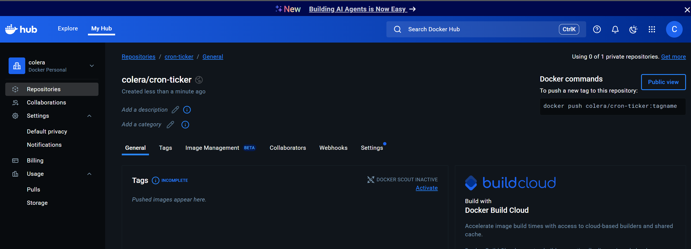
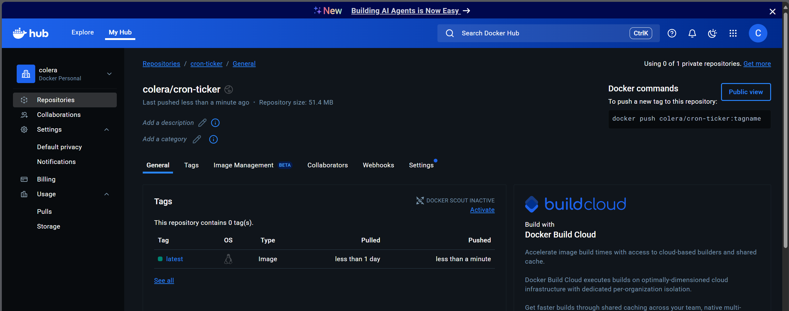
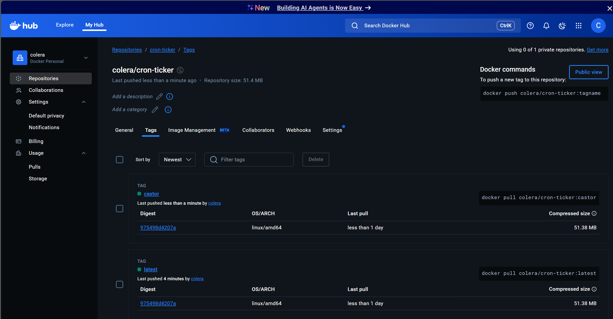

# Subir Imagen a Docker hub

1. Registrar en [docker hub](https://hub.docker.com/)
2. Crear repositiorio y copiar nombre `colera/cron-ticker`

3. Renombrar la imagne que se desea subir con el nombre del repositorio

```bash
$ docker image tag cron-ticker colera/cron-ticker 
```
> Nota: Lo creará con la versión `latest`

4. Verificar, listando las imagenes
```bash
$ docker image ls
REPOSITORY           TAG       IMAGE ID       CREATED       SIZE
colera/cron-ticker   latest    9ba401c71ccb   4 hours ago   175MB
cron-ticker          latest    9ba401c71ccb   4 hours ago   175MB
<none>               <none>    f30e155a6b7a   4 hours ago   175MB
```` 

5. Authenticarse en docker hub en el terminar
```bash
docker login
```

6. Hacer push `docker push colera/cron-ticker:tagname`

```bash
docker push colera/cron-ticker
```



Si quiere subir otra version al repor, hacer push de esa version:

```bash
docker image tag cron-ticker colera/cron-ticker:castor 
docker push colera/cron-ticker:castor
```




---
# Borrar todas las imenges + Cerrar sesion en el terminal + Descargar nuestra imagen

```bash
docker image prune -a
docker logout
docker run colera/cron-ticker:castor

> cron-ticker@1.0.0 start
> node app.js

Inicio de la applicacion
running a task every 5 seconds: 5
running a task every 5 seconds: 10
...
```
