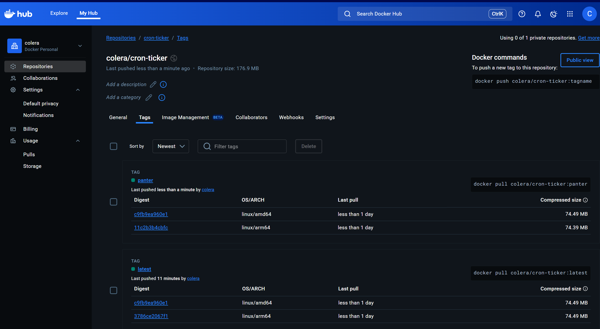
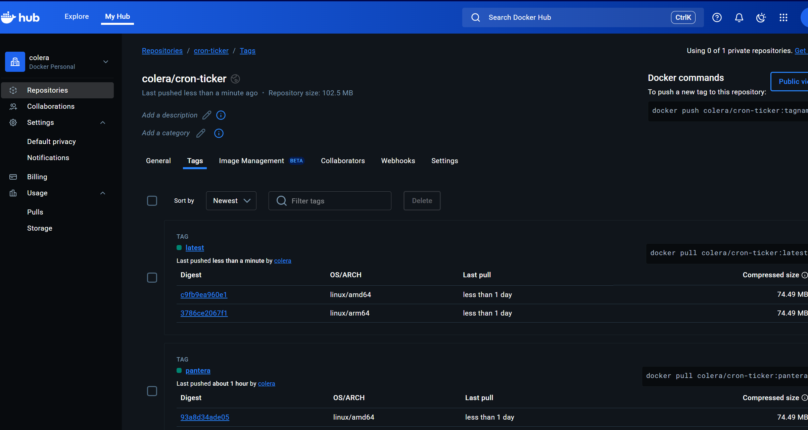

# Buildx

[Buildx](https://docs.docker.com/build/building/multi-platform/#getting-started) es una extensión avanzada de Docker que permite construir imágenes de contenedor usando una arquitectura moderna y flexible, ideal para entornos multi-plataforma  (_por ejemplo, construir una imagen para Linux/amd64 y Linux/arm64 desde la misma máquina_).

Nota: Ejemplo en  11-dockerfile-buildx/cron-ticker

```bash
# Ejeuctar comadnos en:
cd /mnt/c/Users/andre/Documents/Angular-Docker-Cero-Experto/doc/ejercicios/11-dockerfile-buildx/cron-ticker
```
---

## 🧱 ¿Qué es Docker Buildx?

**`docker buildx`** es un **CLI extendido de `docker build`** que proporciona soporte para:

* 🔄 **Build multi-plataforma** (arm64, amd64, etc.)
* 🧩 **Drivers avanzados** como BuildKit
* 📦 **Cache compartido y remoto**
* 🐳 Construcción en contenedores, máquinas remotas o en clusters
* 🧪 Compatibilidad con múltiples entornos de compilación

---

## 🚀 ¿Por qué usar `buildx`?

* Construyes una imagen en tu máquina x86 que puede ejecutarse en un Raspberry Pi (ARM).
* Puedes exportar directamente a un registro (`docker push`) sin tener que guardar la imagen localmente.
* Mejor uso de cache y soporte para `--output` personalizado.

```bash
# Listar las buildx dispoibles
docker buildx ls
```
---

## 🧪 Ejemplo de uso básico

### 🔧 Habilita `buildx`:

```bash
# Descarga una imange para generar build y configura para ser usa (por defecto todas las plataformas)
docker buildx create --name mybuilder --use

# Plataformas que se peude usar (opcional)
docker buildx inspect --bootstrap

# Ver la iamgne que se creo (ocpional)
docker image ls
REPOSITORY           TAG               IMAGE ID       CREATED          SIZE
moby/buildkit        buildx-stable-1   72a94020693f   8 weeks ago      216MB
```

### 🏗 Construir una imagen multi-plataforma:

```bash
docker buildx build --platform linux/amd64,linux/arm64 -t usuario/imagen:tag --push .
```

> `--platform`: indica las arquitecturas objetivo
> `--push`: sube directamente al registry (no guarda localmente)
> `--load`: (opcional) carga la imagen localmente, pero solo si construyes para tu arquitectura, es decir, si no se no se pone `--platform=$BUILDPLATFORM` en `FROM node:19.2.0-alpine3.17`

### Nota
Si se usa `docker buildx build --platform linux/amd64,linux/arm64`, aunque se ponga solo `FROM node:19.2.0-alpine3.17` en el `Dockerfile`, va ha generar una imagen para todas las plataformas que se indique en el comando.
```bash
$ docker buildx build --platform linux/amd64,linux/arm64 -t colera/cron-ticker --push .
```



---

## 📁 Estructura típica para multi-plataforma

```dockerfile
# Dockerfile
# Imagen base
#FROM --platform=$BUILDPLATFORM  node:19.2.0-alpine3.17
FROM   node:19.2.0-alpine3.17

# Establece el directorio de trabajo
WORKDIR /app

# Copia solo las dependencias primero (para aprovechar el cache)
COPY package.json ./

# Instala las dependencias
RUN npm install

# Copia el resto del código fuente (no es buena practica)
COPY . .

# Ejecuta los test
RUN npm run test

# Limpair los ficheros / dependencias no necesarias para produccion
RUN rm -rf tests && rm -rf node_modules

# Instalar solo las dependeicas de produccion
RUN npm install --prod

# Comando por defecto al iniciar el contenedor
CMD ["npm", "start"]

```

Y luego construyes para varias plataformas:

```bash
docker buildx build --platform linux/amd64,linux/arm64 -t colera/cron-ticker --push .


# Ver imagnes
docker image ls
REPOSITORY           TAG               IMAGE ID       CREATED          SIZE
colera/cron-ticker   latest            2925aae50679   47 minutes ago   245MB
moby/buildkit        buildx-stable-1   72a94020693f   8 weeks ago      216MB
```



---

## 🔍 Documentación oficial

Tu enlace es válido:
👉 [https://docs.docker.com/build/building/multi-platform/](https://docs.docker.com/build/building/multi-platform/)

---

## Crear y modificar un buildx


```bash
# The following command creates a multi-node builder from Docker contexts named node-amd64 and node-arm64
docker buildx create --use --name mybuild node-amd64
mybuild

docker buildx create --append --name mybuild node-arm64
docker buildx build --platform linux/amd64,linux/arm64 .
```

## Cambiar de buildx y eliminar

```bash
docker buildx ls
NAME/NODE        DRIVER/ENDPOINT                   STATUS     BUILDKIT   PLATFORMS
mybuilder*       docker-container                                        
 \_ mybuilder0    \_ unix:///var/run/docker.sock   inactive              
default          docker                                                  
 \_ default       \_ default                       running    v0.23.2    linux/amd64 (+3), linux/386

docker buildx use default
docker buildx rm -f mybuilder0

docker buildx rm -f mybuilder
mybuilder removed
```