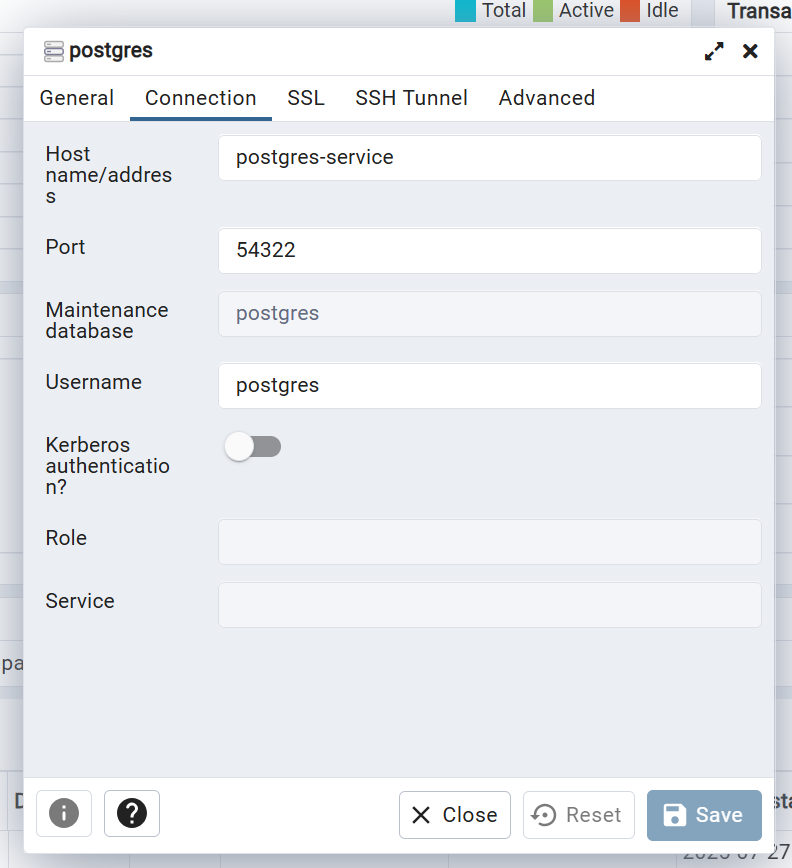

# Kurbenetes (k8s)
Platafomra para automatizzar el despliegue, escla y manejo de contenedores.

## Orquestación

Coordina los contenedores (downtimes, réplicas, ...)

## Componentes

## 🧩 Componentes Principales de Kubernetes

### 🟦 Pod
- Unidad más pequeña y básica desplegable en Kubernetes.
- Encapsula uno o varios contenedores que comparten red y almacenamiento.
- Tiene una IP dinámica asignada.
- Es efímero: puede ser eliminado o recreado por K8s.
- Ideal para contener un solo proceso o servicio.

### 🟨 Service
- Expone uno o más Pods a través de una IP estática y un nombre DNS.
- Desacopla el acceso del cliente a los Pods individuales.
- Balancea la carga entre múltiples Pods.
- Los Pods pueden morir o reiniciarse, pero el Service sigue siendo estable.
- Ciclo de vida independiente del Pod.

### 🌐 Ingress
- Gestiona el acceso externo (HTTP/HTTPS) a los servicios internos.
- Permite enrutar peticiones entrantes a diferentes Services usando reglas de URL o dominio.
- Requiere un controlador de Ingress (como NGINX o Traefik).
- Es más avanzado que simplemente exponer puertos.

### ⚙️ ConfigMap
- Almacena datos de configuración públicos (por ejemplo, URLs, nombres de servicios, etc.).
- Se puede montar como volumen o inyectar como variables de entorno.
- Permite mantener la configuración separada del contenedor.

### 🔐 Secret
- Similar a ConfigMap, pero para datos sensibles (credenciales, tokens, claves).
- La información debe estar codificada en base64.
- No es completamente seguro por sí solo, pero mejora la gestión de secretos.

### 💾 Volume
- Proporciona almacenamiento persistente a los Pods.
- Similar a los volúmenes de Docker.
- Kubernetes no gestiona la persistencia directamente: depende del provisionador (NFS, AWS EBS, etc.).
- Los datos pueden sobrevivir a la eliminación de un Pod.

### 🚀 Deployment
- Define un "blueprint" para gestionar la creación y actualización de Pods.
- Controla el número de réplicas (escalado automático o manual).
- Facilita los rollouts y rollbacks de versiones de contenedores.

### 🗃️ StatefulSet
- Similar a Deployment, pero pensado para aplicaciones con estado, como bases de datos.
- Cada Pod tiene:
- Nombre único y persistente.
- Almacenamiento propio y persistente.
- Mantiene el orden y la identidad de los Pods.
## Instlacion

[minikube](https://minikube.sigs.k8s.io/docs/), herramienta para aprender K8s, el cual, crea un contenedor que contiente un contenedor de Kubernetes.

### Instalacion en Linux

Nota: Valido también para Ubuntu WSL

```bash
curl -LO https://github.com/kubernetes/minikube/releases/latest/download/minikube-linux-amd64
sudo install minikube-linux-amd64 /usr/local/bin/minikube && rm minikube-linux-amd64
```

Como Minikube usa kubectl, así que primero comprueba:
```bash
kubectl version --client
# o
kubectl version
# o
kubectl version --short
```
Si da error, ejeucta esto para instalarlo
```bash
minikube kubectl -- get pods -A

# o bien, enlázlao directamente:
alias kubectl="minikube kubectl --"
```

Inicializar el cluster:
```bash
minikube start
```

# Ejercicio 17-k8s-teslo

## Provision de una base de datos.

### ConfigMap de la bbdd Postgres
Crear un fichero **postgres-config.yml**, que contenga los [**ConfigMap**](https://kubernetes.io/docs/concepts/configuration/configmap/)

```yml
apiVersion: v1
kind: ConfigMap
# nombre que se usara en el cluster, para acceder los key
metadata:
  name: postgres-config
data:
  DB_NAME: postgress
  DB_HOST: postgres-service
  DB_POST: "5432"
```

### Secretos de la base de datos
Crear un fichero **postgres-secrets.yml**, que contenga los [**Secret**](https://kubernetes.io/docs/concepts/configuration/secret/)

La informacion debe estar codificada en [base64](https://codebeautify.org/base64-encode) o con el comando `echo -n ostgres | base64`

```yml
apiVersion: v1
kind: Secret
metadata:
  name: postgres-secrets
data:
  # postgres
  DB_USER: cG9zdGdyZXM=
  # EstoEsUnPasswordSecreto
  DB_PASSWORD: RXN0b0VzVW5QYXNzd29yZFNlY3JldG8=
```

### Pods, Services y Deployments

Creando un Deployments, se crea un Pods y Servicio de forma indirecta
 
1. Crear el fichero `postgres.yml`, que contega la estructura de un [Deployments](https://kubernetes.io/docs/concepts/workloads/controllers/deployment/)

2. En l mismo fiechor `postgres.yml`, añade un servicio [Servicio](https://kubernetes.io/es/docs/concepts/services-networking/service/), que permita conectar la base de datos.

> Nota: El nombre del servicio será el mismo nombre que el definico como `DB_HOST` en el `postgres-config.yml`

```yml
apiVersion: apps/v1
kind: Deployment
metadata:
  name: postgres-deployment
  labels:
    app: postgres
# Especificacion del Pods
spec:
  replicas: 1
  selector:
    matchLabels:
      app: postgres
  template:
    metadata:
      labels:
        app: postgres
    # Definición del contenedor a montar
    spec:
      containers:
      - name: postgress
        image: postgres:15.1
        ports:
        - containerPort: 5432
        env:
#          - name: POSTGRES_DB
#            value: postgress
#          - name: POSTGRES_USER
#            valueFrom:
#              # Busca en el "postgres-secrets.yml", las keys
#              secretKeyRef:
#                name: postgres-secrets
#                key: DB_USER
          - name: POSTGRES_PASSWORD
            valueFrom:
              # Busca en el "postgres-secrets.yml", las keys
              secretKeyRef:
                name: postgres-secrets
                key: DB_PASSWORD
#          volumeMounts:
#            - name: postgres-storage
#              mountPath: /var/lib/postgresql/data
#      volumes:
#        - name: postgres-storage
#          persistentVolumeClaim:
#            claimName: postgres-pvc

## Crea un servicio nuevo en el mismo fichero
---
apiVersion: v1
kind: Service
metadata:
  name: postgres-service
spec:
  selector:
    # puede ser cualquier key quep arta de app
    app: postgres
  # Puerto para acceder desde el puesto exteriror
  ports:
    - protocol: TCP
      port: 54322 # cualquier perto
      targetPort: 5432 # puerto del contenedor

```

3. Desplegar la base de datos en el cluster (_minikube_)

```bash
cd ../17-k8s-teslo

ls
postgres-config.yml  postgres-secrets.yml  postgres.yml

# ip del custer
kubectl get nodes
NAME       STATUS   ROLES           AGE   VERSION
minikube   Ready    control-plane   36s   v1.33.1

kubectl get all
NAME                 TYPE        CLUSTER-IP   EXTERNAL-IP   PORT(S)   AGE
service/kubernetes   ClusterIP   10.96.0.1    <none>        443/TCP   65s


# si diera problema, ejeucta
minikube delete
minikube start --driver=docker
alias kubectl="minikube kubectl --"
minikube logs

# Ejecutar en orden, en funión de las dependencias
kubectl apply -f postgres-config.yml 
configmap/postgres-config created

kubectl apply -f postgres-secrets.yml 
secret/postgres-secrets created

kubectl apply -f postgres.yml 
deployment.apps/postgres-deployment created
service/postgres-service unchanged

# verificmaos los nodos
kubectl get all
NAME                                       READY   STATUS              RESTARTS   AGE
pod/postgres-deployment-7d65c65db4-g4zg4   0/1     ContainerCreating   0          32s

NAME                       TYPE        CLUSTER-IP       EXTERNAL-IP   PORT(S)     AGE
service/kubernetes         ClusterIP   10.96.0.1        <none>        443/TCP     4m9s
service/postgres-service   ClusterIP   10.106.109.153   <none>        54322/TCP   2m12s

NAME                                  READY   UP-TO-DATE   AVAILABLE   AGE
deployment.apps/postgres-deployment   0/1     1            0           32s

NAME                                             DESIRED   CURRENT   READY   AGE
replicaset.apps/postgres-deployment-7d65c65db4   1         1         0       32s
```

Ver el proceso de arranque de un deploymet concreto:
```bash
kubectl describe deployment.apps/postgres-deployment

Name:                   postgres-deployment
Namespace:              default
CreationTimestamp:      Sun, 27 Jul 2025 13:55:46 +0200
Labels:                 app=postgres
Annotations:            deployment.kubernetes.io/revision: 1
Selector:               app=postgres
Replicas:               1 desired | 1 updated | 1 total | 1 available | 0 unavailable
StrategyType:           RollingUpdate
MinReadySeconds:        0
RollingUpdateStrategy:  25% max unavailable, 25% max surge
Pod Template:
  Labels:  app=postgres
  Containers:
   postgress:
    Image:      postgres:15.1
    Port:       5432/TCP
    Host Port:  0/TCP
    Environment:
      POSTGRES_PASSWORD:  <set to the key 'DB_PASSWORD' in secret 'postgres-secrets'>  Optional: false
    Mounts:               <none>
  Volumes:                <none>
  Node-Selectors:         <none>
  Tolerations:            <none>
Conditions:
  Type           Status  Reason
  ----           ------  ------
  Available      True    MinimumReplicasAvailable
  Progressing    True    NewReplicaSetAvailable
OldReplicaSets:  <none>
NewReplicaSet:   postgres-deployment-7d65c65db4 (1/1 replicas created)
Events:
  Type    Reason             Age    From                   Message
  ----    ------             ----   ----                   -------
  Normal  ScalingReplicaSet  2m28s  deployment-controller  Scaled up replica set postgres-deployment-7d65c65db4 from 0 to 1
```

Ver los logs
```bash
kubectl logs  pod/postgres-deployment-7d65c65db4-g4zg4
T...
server stopped

PostgreSQL init process complete; ready for start up.

2025-07-27 11:57:16.022 UTC [1] LOG:  starting PostgreSQL 15.1 (Debian 15.1-1.pgdg110+1) on x86_64-pc-linux-gnu, compiled by gcc (Debian 10.2.1-6) 10.2.1 20210110, 64-bit
2025-07-27 11:57:16.023 UTC [1] LOG:  listening on IPv4 address "0.0.0.0", port 5432
2025-07-27 11:57:16.023 UTC [1] LOG:  listening on IPv6 address "::", port 5432
2025-07-27 11:57:16.033 UTC [1] LOG:  listening on Unix socket "/var/run/postgresql/.s.PGSQL.5432"
2025-07-27 11:57:16.046 UTC [62] LOG:  database system was shut down at 2025-07-27 11:57:15 UTC
2025-07-27 11:57:16.056 UTC [1] LOG:  database system is ready to accept connections
``` 

### Añadri un PG-Admin al cluster para gestionar la base de datos

1. Craer el `pg-admin-secrets.yml`
2. Crear el servicio, pord y deployment `pg-admin.yml`
3. Levantar

```bash
kubectl apply -f pg-admin-secrets.yml
secret/pg-admin-secrets created

kubectl apply -f pg-admin.yml
deployment.apps/pg-admin-deployment created
service/pg-admin-service created

# Ver los nodos corriendo
kubectl get all
NAME                                       READY   STATUS    RESTARTS   AGE
pod/pg-admin-deployment-5756c474f6-zpcvd   1/1     Running   0          113s
pod/postgres-deployment-7d65c65db4-g4zg4   1/1     Running   0          33m

NAME                       TYPE        CLUSTER-IP       EXTERNAL-IP   PORT(S)        AGE
service/kubernetes         ClusterIP   10.96.0.1        <none>        443/TCP        37m
service/pg-admin-service   NodePort    10.101.38.14     <none>        80:30200/TCP   14m
service/postgres-service   ClusterIP   10.106.109.153   <none>        54322/TCP      35m

# Ver datos de un node
kubectl describe pod/pg-admin-deployment-5756c474f6-zpcvd
....


kubectl logs  pod/pg-admin-deployment-5756c474f6-zpcvd
NOTE: Configuring authentication for SERVER mode.

pgAdmin 4 - Application Initialisation
======================================

[2025-07-27 12:28:01 +0000] [1] [INFO] Starting gunicorn 20.1.0
[2025-07-27 12:28:01 +0000] [1] [INFO] Listening at: http://[::]:80 (1)
[2025-07-27 12:28:01 +0000] [1] [INFO] Using worker: gthread
[2025-07-27 12:28:01 +0000] [91] [INFO] Booting worker with pid: 91
...
...
```


## Inicar pg-Admin con postgres

```bash
minikube delete
alias kubectl="minikube kubectl --"
minikube start --driver=dockerminikube start --driver=docker

# 
kubectl apply -f postgres-secrets.yml
kubectl apply -f postgres.yml
kubectl get all

kubectl apply -f pg-admin-secrets.yml
kubectl apply -f pg-admin.yml
kubectl get all
kubectl describe deployment.apps/pg-admin-deployment
kubectl logs deployment.apps/pg-admin-deployment

minikube service pg-admin-service
|-----------|------------------|-------------|---------------------------|
| NAMESPACE |       NAME       | TARGET PORT |            URL            |
|-----------|------------------|-------------|---------------------------|
| default   | pg-admin-service |          80 | http://192.168.49.2:30200 |
|-----------|------------------|-------------|---------------------------|
🏃  Starting tunnel for service pg-admin-service.
|-----------|------------------|-------------|------------------------|
| NAMESPACE |       NAME       | TARGET PORT |          URL           |
|-----------|------------------|-------------|------------------------|
| default   | pg-admin-service |             | http://127.0.0.1:42427 |
|-----------|------------------|-------------|------------------------|
🎉  Opening service default/pg-admin-service in default browser...
👉  http://127.0.0.1:42427
❗  Because you are using a Docker driver on linux, the terminal needs to be open to run it.
```



## Agregar el BackendApp al Cluster

Consite en añadir una imange de docker con servidor que utiliza una conexión a base de datos postgres [k8s-teslo-backend](https://hub.docker.com/r/klerith/k8s-teslo-backend).

El objetio es integrar en el cluster esta imagen y se comunice con la base de datos.

1. Crear el fichero `backend-secrets.yml`
2. Crear el `backend.yml`, con el pod, service y deployment

Integrar a minikube e iniciar:

```bash
```bash
minikube delete
alias kubectl="minikube kubectl --"
minikube start --driver=dockerminikube start --driver=docker

# 
kubectl apply -f postgres-secrets.yml
kubectl apply -f postgres.yml
kubectl get all

kubectl apply -f pg-admin-secrets.yml
kubectl apply -f pg-admin.yml
kubectl get all

kubectl apply -f postgres-config.yml 
kubectl apply -f backend-secrets.yml
kubectl apply -f backend.yml 
kubectl get all

kubectl describe deployment.apps/backend-deployment
kubectl logs service/backend-service  

minikube service backend-service  

# nota
kubectl rollout restart deployment
# o 
kubectl rollout restart deployment.apps/backend-deployment 
# nota
# kubectl delete deployment.apps/backend-deployment 

# nota
minikube delete -all
```

[code-klerith](https://github.com/Klerith/k8s-teslo)

## Web oficial

[kubernetes](https://kubernetes.io/es/)