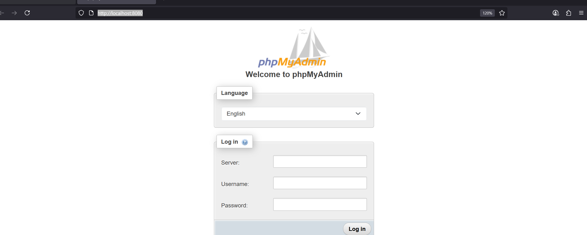
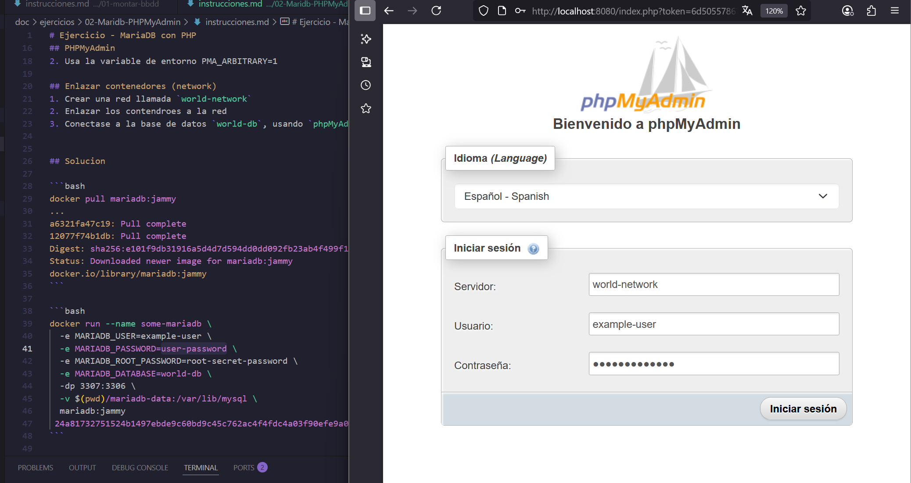
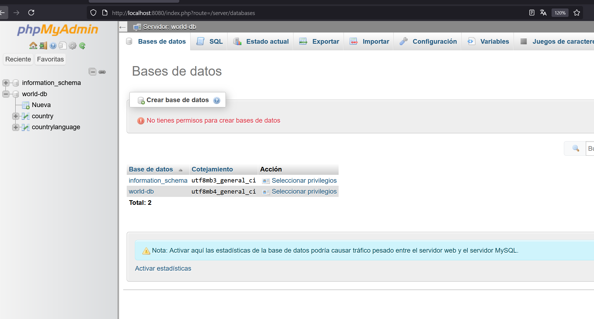

# Ejercicio - MariaDB con PHP

## Base de datos
1. Montar la imagen de MariaDB con el tag jammy, publicar en el puerto 3306 del contenedor con el puerto 3306 de nuestro equipo, colocarle el nombre al contenedor de __world-db__ (--name world-db) y definir las siguientes variables de entorno:
    * MARIADB_USER=example-user
    * MARIADB_PASSWORD=user-password
    * MARIADB_ROOT_PASSWORD=root-secret-password
    * MARIADB_DATABASE=world-db

2. Conectarse usando Table Plus a la base de datos con las credenciales del usuario (NO EL ROOT)
3. Conectarse a la base de datos ```world-db```
4. Ejecutar el query de creación de tablas e inserción proporcionado
5. Revisar que efectivamente tengamos la data
6. Añadir al volumen del host $(pwd)/mariadb-data

## PHPMyAdmin
1. Descarga la imange de phpmyadmin oficial de docker [link](https://hub.docker.com/_/phpmyadmin/tags)
2. Usa la variable de entorno PMA_ARBITRARY=1 (PMA_ARBITRARY=1 permite escribir manualmente el host de la base de datos.)

## Enlazar contenedores (network)
1. Crear una red llamada `world-network`
2. Enlazar los contendroes a la red
3. Conectase a la base de datos `world-db`, usando `phpMyAdmin`


## Solucion
Excelente, estás documentando muy bien el proceso. A continuación, te presento una **versión resumida, clara y estructurada** de tus apuntes sobre cómo levantar MariaDB + phpMyAdmin en contenedores separados, conectarlos mediante una red personalizada en Docker y probar la conexión:

---

# 🐳 Ejercicio: MariaDB + phpMyAdmin con Docker

---

## 📦 1. Crear la red personalizada

Para que los contenedores se comuniquen entre sí:

```bash
docker network create world-network
```

---

## 🛢️ 2. Levantar el contenedor de MariaDB

```bash
docker run -d \
  --name world-db \
  --network world-network \
  -e MARIADB_USER=example-user \
  -e MARIADB_PASSWORD=user-password \
  -e MARIADB_ROOT_PASSWORD=root-secret-password \
  -e MARIADB_DATABASE=world-db \
  -v $(pwd)/mariadb-data:/var/lib/mysql \
  -p 3306:3306 \
  mariadb:jammy
```
> Alternativamente se puede crear el contendedor sin `--network` y luego conectarlo con
> ```bash
> docker network connect world-network <id_container>
> ```
---

## 🧪 3. Verificar con TablePlus/DBeaver

* Conéctate con:

  * **Host:** `localhost`
  * **Puerto:** `3306`
  * **Usuario:** `example-user`
  * **Contraseña:** `user-password`
  * **Base de datos:** `world-db`
* Ejecuta el script de creación de tablas e inserción de datos.
* Verifica que las tablas y los datos estén presentes.


---

## 🧭 4. Levantar el contenedor de phpMyAdmin

```bash
docker run -d \
  --name phpmyadmin \
  --network world-network \
  -e PMA_HOST=world-db \
  -e PMA_ARBITRARY=1 \
  -p 8080:80 \
  phpmyadmin:5.2.2-apache
```

* Accede a `http://localhost:8080`
* Conéctate usando:

  * **Servidor:** `world-db` (nombre del contenedor)
  * **Usuario:** `example-user`
  * **Contraseña:** `user-password`






---

## 🔧 Comandos útiles

```bash
docker network
docker network connect --help
```

### 🔍 Inspeccionar la red

```bash
docker network inspect world-network
```

### 📜 Ver contenedores y redes

```bash
docker ps
docker network ls
```

### Eliminar network

```bash
# Borra una red dada, que no este en uso
docker network rm -f <id_network/alias_network>

# Borra las redes que no estan en uso
docker network prune 
```

## 🧠 Notas clave

* **`PMA_ARBITRARY=1`** permite escribir manualmente el host de la base de datos.
* El nombre del contenedor **(ej. `world-db`)** actúa como nombre DNS interno dentro de la red de Docker.
* La opción `--link` está obsoleta. Usa redes (`docker network`) en su lugar.
* Usa volúmenes (`-v`) para persistencia de datos.

---

## 🖼️ Vista en navegador

Cuando todo está funcionando, accede a:

```
http://localhost:8080
```

Y deberías ver algo como esto:

