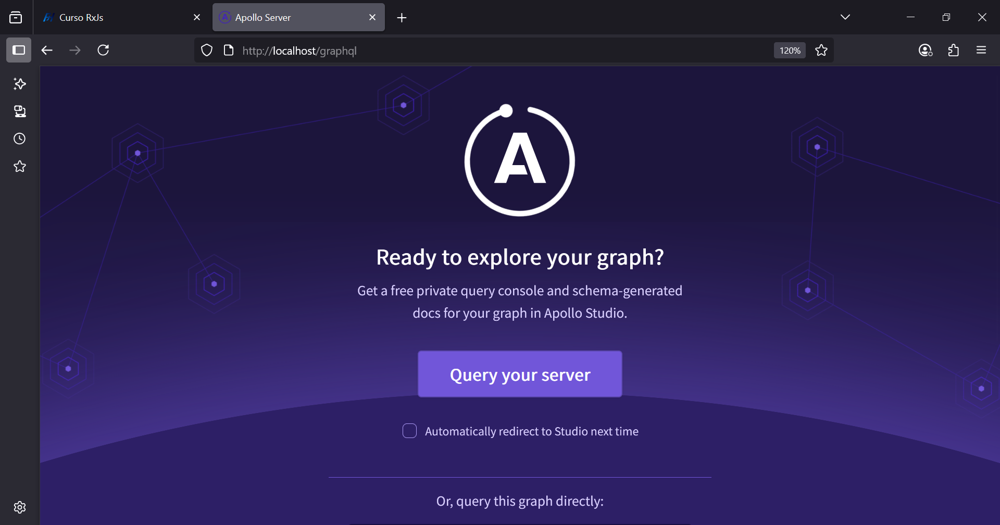

Aquí tienes los apuntes del **Ejercicio de Bind Volumes en Docker** en formato **Markdown**, estructurados y claros para repasar o documentar:

# 🐳 Ejercicio – Bind Volumes con Docker

## 🎯 Objetivo

Correr la aplicación **`nest-graphql-app`** dentro de un contenedor Docker basado en **Linux + Node.js 16**, usando **Bind Mounts**, y realizar:

* Montaje de código local en el contenedor
* Instalación de dependencias
* Ejecución de la app NestJS

---

## 📋 Tareas

### ✅ 1. Crear y ejecutar un contenedor con estas características:

* **Nombre del contenedor**: `nest-app`
* **Imagen base**: `node:16-alpine3.18` (o `node:18-alpine3.21` si hay problemas de compatibilidad)
* **Directorio de trabajo en el contenedor**: `/app`
* **Bind mount**: vincular carpeta local del proyecto a `/app`
* **Puertos**: exponer el puerto `3000` del contenedor al puerto `80` del host

---

### 📥 2. Descargar imagen desde Docker Hub

```bash
docker pull node:16-alpine3.18
```

> ⚠️ Si recibes un error como:

```
error todo@0.0.1: The engine "node" is incompatible with this module. Expected version "18.x". Got "16.20.2"
```

➡️ Usa mejor:

```bash
docker pull node:18-alpine3.21
```

---

### 🧱 3. Crear y ejecutar el contenedor

```bash
docker container run \
  --name nest-app \
  -w /app \
  -p 80:3000 \
  -v "$(pwd)/doc/ejercicios/03-bind-volumes/nest-graphql-app":/app \
  node:18-alpine3.21 \
  sh -c "yarn install && yarn start:dev"

# se demora bastante
[3:45:24 PM] Starting compilation in watch mode...

[3:51:21 PM] Found 0 errors. Watching for file changes.
5, 3:53:16 PM     LOG [NestFactory] Starting Nest application...
[Nest] 87  - 07/15/2025, 3:53:16 PM     LOG [InstanceLoader] AppModule dependencies initialized +66ms
[Nest] 87  - 07/15/2025, 3:53:16 PM     LOG [InstanceLoader] HelloWorldModule dependencies initialized +0ms
[Nest] 87  - 07/15/2025, 3:53:16 PM     LOG [InstanceLoader] TodoModule dependencies initialized +1ms
[Nest] 87  - 07/15/2025, 3:53:16 PM     LOG [InstanceLoader] GraphQLSchemaBuilderModule dependencies initialized +2ms
[Nest] 87  - 07/15/2025, 3:53:16 PM     LOG [InstanceLoader] GraphQLModule dependencies initialized +1ms
[Nest] 87  - 07/15/2025, 3:53:23 PM     LOG [GraphQLModule] Mapped {/graphql, POST} route +6980ms
[Nest] 87  - 07/15/2025, 3:53:23 PM     LOG [NestApplication] Nest application successfully started +4ms

```

---

## 📝 Notas importantes

* `-w /app` ➝ Cambia el directorio de trabajo dentro del contenedor (como hacer `cd /app`).
* `-v ...:/app` ➝ Usa un **bind mount** para que el código local esté disponible en el contenedor en tiempo real.
* `-p 80:3000` ➝ Redirige el tráfico desde el puerto 80 del host al puerto 3000 del contenedor (Nest por defecto).
* El comando final (`sh -c ...`) permite instalar las dependencias y arrancar la aplicación.

---

## ✅ Verificación

Después de ejecutar, abre en tu navegador:

```
http://localhost/graphql
```

Deberías ver la app NestJS corriendo si todo está correcto.


---

## 🛑 Detener y eliminar contenedor (si es necesario)

```bash
docker container stop nest-app
docker container rm nest-app
```

--- 

# 🐳 Anexo – Docker Bind Volumes + Modo Interactivo

Correr en segundo plano + logs + terminal iteracitva (-it)

```shell
# Ejecutar el terminal iteractivo
$ docker exec -it <id|nombre> <executable>
```

## 🎯 Objetivo

* Ejecutar el contenedor en **segundo plano**
* Acceder a **logs en vivo**
* Ingresar a la **terminal del contenedor**
* Ver la estructura del proyecto montado

---

## ✅ Comando para ejecutar en segundo plano

```bash
docker container run \
  --name nest-app \
  -w /app \
  -dp 80:3000 \
  -v "$(pwd)/doc/ejercicios/03-bind-volumes/nest-graphql-app":/app \
  node:18-alpine3.21 \
  sh -c "yarn install && yarn start:dev"
```

### Explicación de flags:

* `-d` ➝ Ejecuta en segundo plano (modo *detached*)
* `-p 80:3000` ➝ Mapea el puerto del host al del contenedor
* `-v` ➝ Enlaza el código local con el contenedor (bind volume)
* `-w /app` ➝ Directorio de trabajo dentro del contenedor
* `sh -c "...”` ➝ Ejecuta comandos dentro del contenedor

---

## 🧾 Ver logs del contenedor

```bash
docker container logs -f <id|nombre>
```

Ejemplo:

```bash
docker container logs -f f4e4
```

> `-f` sigue los logs en tiempo real

---

## 🖥️ Acceder a la terminal del contenedor

```bash
docker exec -it <id|nombre> /bin/sh
```

Ejemplo:

```bash
docker exec -it f4e4b /bin/sh
```

Una vez dentro:

```bash
# Listar archivos raíz
/ # ls

# Ir al proyecto
/ # cd app && ls
```

Salida esperada:

```plaintext
README.md            package.json         tsconfig.json
dist                 src                  yarn.lock
nest-cli.json        test
node_modules         tsconfig.build.json
```

> Nota: Si el contendor no se ha creado, se puede inicar en modo iteractivo:
> ```shell
> docker container run \
>  -it \
>  --name nest-app \
>  -w /app \
>  -dp 80:3000 \
>  -v "$(pwd)/doc/ejercicios/03-bind-volumes/nest-graphql-app":/app \
>  node:18-alpine3.21 \
>  sh -c "yarn install && yarn start:dev"
>f732554ca34055fedd44b5f69bb5a5c9bfb4b9c550696fd8fb6f6ac61f51a2ab
>
> $ docker exec -it f7325 /bin/sh
> /app #
>```
---
