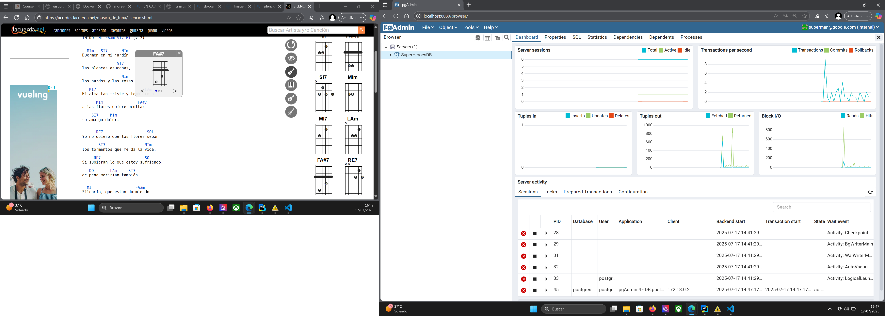

# Solcuion tarea 04

# Contenedor bbdd postgres
####  OJO: No hay puerto publicado -p, lo que hará imposible acceder a la base de datos con TablePlus
```shell
docker container run \
-d \
--name postgres-db \
-e POSTGRES_PASSWORD=123456 \
-v postgres-db:/var/lib/postgresql/data \
postgres:15.1
```

# Contenedor pgAdmin
```shelldock
docker container run \
--name pgAdmin \
-e PGADMIN_DEFAULT_PASSWORD=123456 \
-e PGADMIN_DEFAULT_EMAIL=superman@google.com \
-dp 8080:80 \
dpage/pgadmin4:6.17
```
# Creando la red

```shell
$ docker network create postgres-net
a7986a35a319df4efd007108923046b86c7ecce3ba9400e6ce311d662333a9cc
```

# Unir los contenedores a la red

```shell
$ docker container ls -a
CONTAINER ID   IMAGE                 COMMAND                  CREATED         STATUS         PORTS                                              NAMES
e3bdff6a34bb   dpage/pgadmin4:6.17   "/entrypoint.sh"         6 minutes ago   Up 6 minutes   443/tcp, 0.0.0.0:8080->80/tcp, [::]:8080->80/tcp   pgAdmin
fd5f75ac7a41   postgres:15.1         "docker-entrypoint.s…"   9 minutes ago   Up 9 minutes   5432/tcp                                           postgres-db

docker network connect postgres-net e3bdff6a34bb
docker network connect postgres-net fd5f75ac7a41

$ docker container restart e3bdff6a34bb
e3bdff6a34bb
$ docker container restart fd5f75ac7a41
fd5f75ac7a41
```

