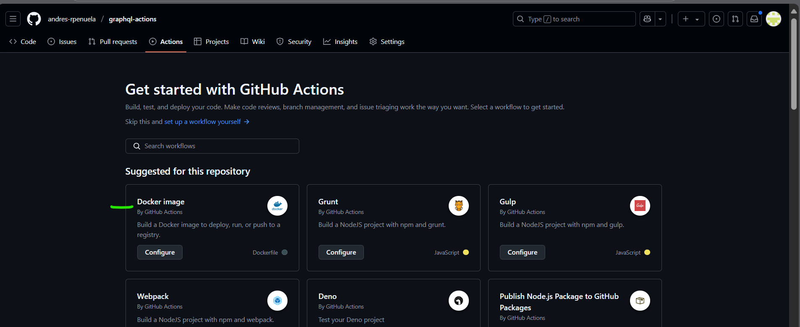

# Construccioens automáticas - GitHub Action

1. Crear repositorio Github: https://github.com/andres-rpenuela/graphql-actions
2. Subir al repositorio el proyecto dado en la clase:  graphql-actions.zip


3. Crear `Actions Secrets` (_variables ocultas para github_), una variable con el nombre de usuario de DockerHub y la otra la pastword o token


4. Usar `Docker Image` de GitHubActions para configurar un nuevo workflows, a partir de una plantilla.



5. (opcional) Comprobar que monte bien la imange y subir la image de DockerFile del proyecto node a un repositorio de DockerHub

```bash
docker build -t colera/graphql-actions:1.0.0 .
docker container run -d -p 3000:3000 colera/graphql-actions:1.0.0

#En un navegador: http://localhost:3000/graphql

docker push colera/graphql-actions:1.0.0
```

6. Github Actions (steps): Objectivo lo que se hizo en el paso 5 pero de forma automatica

```yml
name: Docker Image CI

on:
  push:
    branches: [ "main" ]
  pull_request:
    branches: [ "main" ]

jobs:

  build:

    runs-on: ubuntu-latest

    steps:
    # Toma todo el código que tiene el repositorio
    - name: Checkout code
      uses: actions/checkout@v4
      with:
        fetch-depth: 0
    # Gestion de la version automatica
    - name: Git Semantic Version
      uses: PaulHatch/semantic-version@v4.0.3
      with:
        # si en el comit esta "major:" indica que es una version mayor 
        major_pattern: "major:"
        # si en el comit esta "feat:" indica que es una version menor
        minor_pattern: "feat:"
        # formato del version deuvelto
        format: "${major}.${minor}.${patch}-prerelease${increment}"
      # id del setp para acceder desde otros steps
      id: version
    # Uso de un usuario de github
    # Dar permitso por token o por Settings → Actions → General → Workflow permissions
    # y marca "Read and write permissions"
    - name: Set up Git user
      run: |
        git config user.name "github-actions[bot]"
        git config user.email "github-actions[bot]@users.noreply.github.com"
    # Crear un tag y lo asocia 
    - name: Create and push Git tag
      run: |
        TAG="v${{ steps.version.outputs.version }}"
        echo "Nuevo tag: $TAG"
        git tag $TAG
        git push origin $TAG
    # Hacer login a docker hub
    - name: Docker login
      env:
        DOCKER_USER: ${{secrets.DOCKER_USERNAME}}
        DOCKER_PWD: ${{secrets.DOCKER_PASSWORD}}
        # accede al estep con id "version", y obtiente la variable la variable de salidad version con "output.version"
        NEW_VERSION: ${{ steps.version.outputs.version }}
      run: |
        echo "Iniciando login"
        echo "${DOCKER_PWD}" | docker login -u "${DOCKER_USER}" --password-stdin
        echo "New version: $NEW_VERSION !!!!!"
    # Generar la imagen
    - name: Build Docker image
      env:
        NEW_VERSION: ${{ steps.version.outputs.version }}
      run: |
        docker build -t ${{ secrets.DOCKER_USERNAME }}/graphql-actions:$NEW_VERSION .
        docker build -t ${{ secrets.DOCKER_USERNAME }}/graphql-actions:latest .
    # Subir imange
    - name: Push Docker image
      env:
        NEW_VERSION: ${{ steps.version.outputs.version }}
      run: |
        docker push ${{ secrets.DOCKER_USERNAME }}/graphql-actions:$NEW_VERSION
        docker push ${{ secrets.DOCKER_USERNAME }}/graphql-actions:latest
```

> Nota: Para la version automaitca usar [Git Sematic Version](https://github.com/marketplace/actions/git-semantic-version?version=v4.0.3)