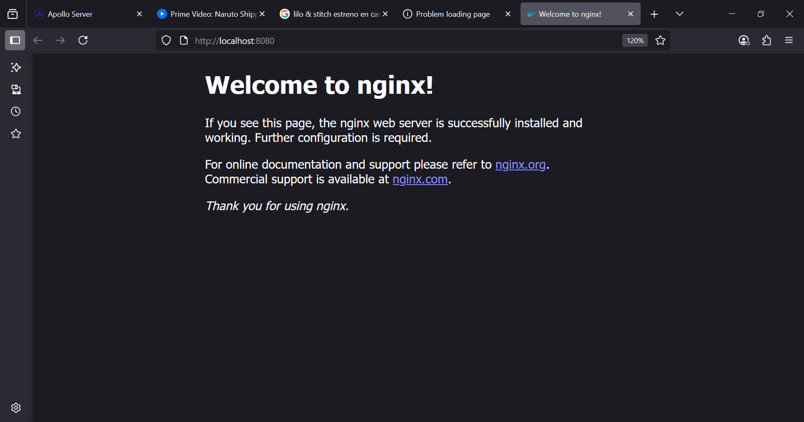

# Tarea

## 1. Descargar Ngix

Descarga la imagne oficial de [Ngix](https://hub.docker.com/_/nginx)

```bash
docker pull nginx:1.29.0-bookworm-otel
```

### Correr en un contender y inspeccionar

```bash
# Si no esta dercada la imange, lo descarga´ra
docker run --name nginx-test -d -p 8080:80 nginx:1.29.0-bookworm-otel
```
> Then you can hit http://localhost:8080 or http://host-ip:8080 in your browser.



```bash
# Ver contenedores de docer corriendo
docker ps
    CONTAINER ID   IMAGE                            ....
    5c6e0bdc4416   nginx:1.29.0-bookworm-otel       ....
    af2d6335c8b3   moby/buildkit:buildx-stable-1    ....

# Ejecutar terminal iteractivo sobre contenedor
docker exec -it 5c6e /bin/sh
    # ls
    bin  boot  dev  docker-entrypoint.d  docker-entrypoint.sh  etc  home  lib  lib64  media  mnt  opt  proc  root  run  sbin  srv  sys  tmp  usr  var


# Listar la carpeta compartida
ls usr/share/nginx/html/
    50x.html  index.html

# Mostrar el fichero de configuracion
# cat /etc/nginx/nginx.conf   
    user  nginx;
    worker_processes  auto;

    error_log  /var/log/nginx/error.log notice;
    pid        /run/nginx.pid;


    events {
        worker_connections  1024;
    }


    http {
        include       /etc/nginx/mime.types;
        default_type  application/octet-stream;

        log_format  main  '$remote_addr - $remote_user [$time_local] "$request" '
                        '$status $body_bytes_sent "$http_referer" '
                        '"$http_user_agent" "$http_x_forwarded_for"';

        access_log  /var/log/nginx/access.log  main;

        sendfile        on;
        #tcp_nopush     on;

        keepalive_timeout  65;

        #gzip  on;

        include /etc/nginx/conf.d/*.conf;
}
``` 

## 2. Crear una imagen con el dist de `react-heroes`

La aplicaicon `reac-heroes`, es una apliacion de node que al hacer el `build`, esta genera un documento html en la carpeta `dist`.

Este contenido será el que se proveera a `nginx`


Crear el Dockerfile con los stage de instalacion de dependnecias, testing, generar la build y desplegar en ngix

```bash
docker build -t heroes-app . --no-cache
docker container run -p 80:80 heroes-app
```
 Then you can hit http://localhost:80 in your browser.

> Nota: Al ser una aplicacion SPA, cuando se accede a `http://localhost/marvel`, da error porque no existe el fichero `index.html`, por lo que se debe solucionar en la configuracion, para que cualquier url rediriga a  index.html.

## 3. Configuracion de Ngix

Ir al fichero de configuracion de de nginx

```
/# cd etc/nginx/
root@463fcd15392e:/etc/nginx# ls
conf.d  fastcgi_params  mime.types  modules  nginx.conf  scgi_params  uwsgi_params
root@463fcd15392e:/etc/nginx# 
```
Copia el cotenido de `nginx.conf` en un fichero nuevo dentro del proeycto `react-hero/nignx/nginx.conf`

```conf
#  Usuario y procesos de trabajo
user  nginx;
worker_processes  auto;

# Archivos de log y PID
error_log  /var/log/nginx/error.log notice;
pid        /run/nginx.pid;


#  número máximo de conexiones simultáneas que puede manejar cada worker.
events {
    worker_connections  1024;
}


http {
    # Define los tipos de archivos que NGINX puede servir. Si no se reconoce el tipo, usa application/octet-stream
    include       /etc/nginx/mime.types;
    default_type  application/octet-stream;

    # Define el formato del log (main) y dónde guardarlo (access.log).
    log_format  main  '$remote_addr - $remote_user [$time_local] "$request" '
                      '$status $body_bytes_sent "$http_referer" '
                      '"$http_user_agent" "$http_x_forwarded_for"';

    access_log  /var/log/nginx/access.log  main;

    # Habilita el envío eficiente de archivos desde disco al socket 
    sendfile        on;
    #tcp_nopush     on;

    # Tiempo en segundos que una conexión HTTP se mantiene abierta
    keepalive_timeout  65;

    # Si lo activas, NGINX puede comprimir respuestas usando GZIP
    #gzip  on;

    # Carga configuraciones adicionales desde archivos como default.conf, app.conf, etc.
    include /etc/nginx/conf.d/*.conf;
}
```

Los puertos y configuraciones de servidor (como listen 80;, server_name, etc.) se encuentran en los archivos incluidos mediante esta línea:
```conf
include /etc/nginx/conf.d/*.conf;
```

Vemos que hay en el servidor:
```bash
.../etc/nginx# ls conf.d/ 
default.conf
```

Copiamos esta estrucutra y la pegamos en nuestro proyecto ``react-hero/nignx/conf.d/default.conf`
```conf
# /etc/nginx# cat conf.d/default.conf 
server {
    listen       80;
    listen  [::]:80;
    server_name  localhost;

    #access_log  /var/log/nginx/host.access.log  main;

    # sirve para manejar las solicitudes a la raíz (/) y rutas del frontend
    location / {
        # directorio raíz del sitio en el sistema de archivos
        root   /usr/share/nginx/html;

        # Archivos por defecto que NGINX busca si el usuario accede a un directorio
        # Por ejemplo, si visitas /about, buscará /usr/share/nginx/html/about/index.html.
        index  index.html index.htm;

        # 1. Intenta servir el archivo exacto solicitado (ej. /about → /usr/share/nginx/html/about)
        # 2. Si no existe, intenta con /about/ (con slash final)
        # 3. Si aún no existe, redirige a /index.html → esto es fundamental para Single Page Applications (SPA) como React, Angular, o Vue.
        try_files $uri $uri/ /index.html;
    }

    #error_page  404              /404.html;

    # redirect server error pages to the static page /50x.html
    #
    error_page   500 502 503 504  /50x.html;
    location = /50x.html {
        root   /usr/share/nginx/html;
    }

    # ...
}
```

Carga esta configuracion en la imagen

```Dockerfile
FROM nginx:1.29.0-bookworm-otel as run
EXPOSE 80
RUN rm /etc/nginx/conf.d/default.conf
COPY nginx/conf.d/default.conf /etc/nginx/conf.d/default.conf
COPY --from=build-dev /app/dist /usr/share/nginx/html
CMD ["nginx","-g","daemon off;"]
```

Generar la imagne: `docker build -t heroes-app . --no-cache`
Inicar un contenedor: `docker run -p 80:80 heroes-app`

## 3. Cargar Imagenes


```Dockerfile
FROM nginx:1.29.0-bookworm-otel as run
EXPOSE 80
RUN rm /etc/nginx/conf.d/default.conf
COPY nginx/conf.d/default.conf /etc/nginx/conf.d/default.conf
COPY --from=build-dev /app/dist /usr/share/nginx/html
COPY  assets/ /usr/share/nginx/html/assets/
CMD ["nginx","-g","daemon off;"]
```
Generar la imagne: `docker build -t heroes-app . --no-cache`
Inicar un contenedor: `docker run -p 80:80 heroes-app`
